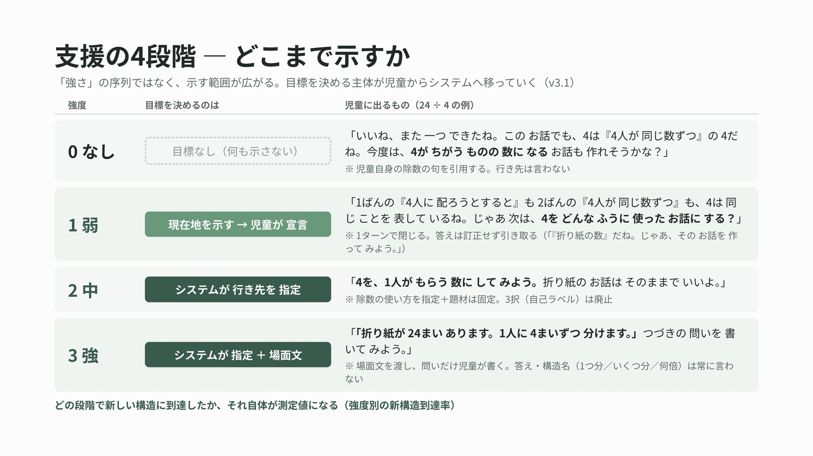
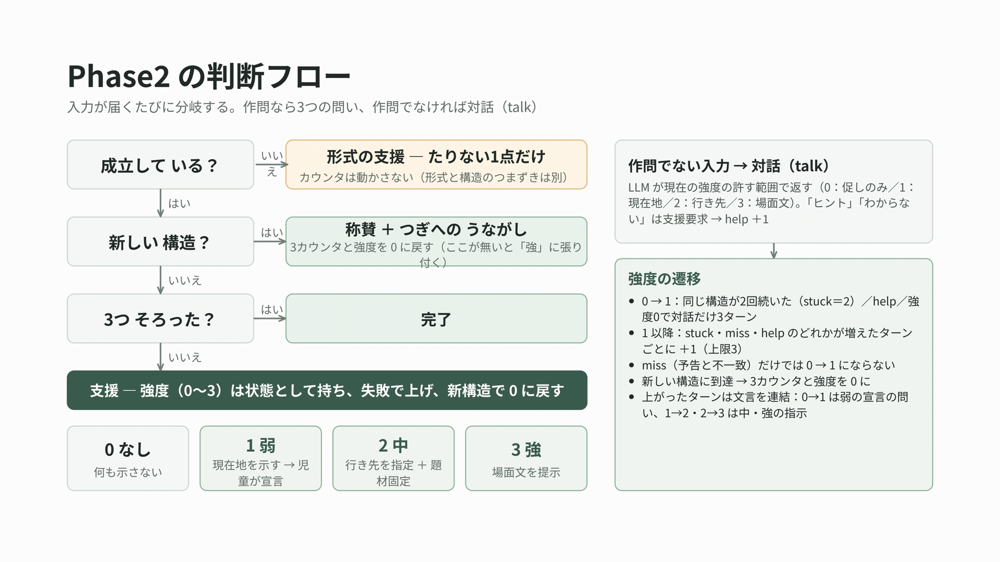
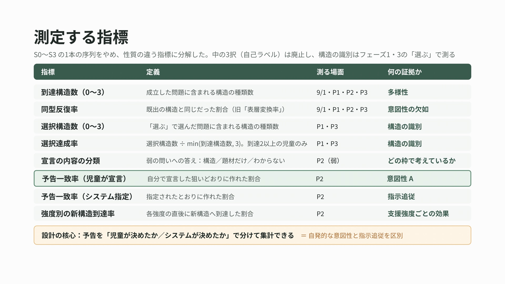

`文章量が大変多く，読みにくくなっています．すみません🙇`
# 作問支援システム

小学4年生が同じ式（例: `24 ÷ 4`）から、意味構造の異なる3種類の文章題（等分除・包含除・倍）を作る活動を支援するWebアプリ。
生成AI（Claude API）が児童の作問を「成立性／構造／求める量」の3層で判定し、
その結果をサーバが決定論的に「応答の種類（response_type）」に変換して児童へ返す。

9/18 授業実践版では、**同じ判定機構を表示のオン／オフだけで測定（フェーズ1・3）と支援（フェーズ2）の両方に使う。**

---

## フェーズ

| フェーズ | 内容 | 式 | 児童に見えるもの |
|---|---|---|---|
| 1 | 事前測定：自由に作問 → 「作った お話を 見る」で3つ選ぶ | 21÷3 / 30÷5 | 入力欄・送信ボタン・自分の吹き出し・「おくったよ」・右パネル「作った 問題」（送った作問の全部。判定は出ない）・「作った お話を 見る」（選択画面） |
| 2 | 支援：フィードバックを受けながら作問（新セッション。フェーズ1は引き継がない） | 24÷4 | ＋ AIの声かけ、「作ったお話」（常設）、信号機（ラベルなしの3灯。フェーズ2のあいだ常時）、目標の固定表示（予告があるあいだ）。選択画面は無い |
| 3 | 事後測定：別の式で自由に作問（新セッション） → 3つ選ぶ | 30÷5 / 21÷3 | フェーズ1と同じ |

フェーズは `app_config` テーブルにあり、管理画面（`/admin`）から切り替える。式は `config.EXPRESSION_ASSIGNMENT`（奇偶×フェーズ）で決まり、セッション開始時に `sessions.expression` に固定する。
児童の画面は5秒ごとに `/api/config` を確認し、変わったら自動で切り替わる。

### 「作った お話を 見る」（フェーズ1・3の選択）

- 入力欄の下にボタン「作った お話を 見る」（緑枠）を置く（フェーズ2には置かない）。児童はいつでも開ける。
- 選択画面：「作った お話の 中から、ちがう 種類の お話を 3つ 選びましょう。」＋ そのフェーズで送った作問（`input_type=sakumon`。不成立・未判定も含む。対話・再送は含めない）を送信順の番号付きで一覧。判定結果・構造名は出さない。
  チェックボックスで最大 min(3, 作問数)。「これで 決定」→ 確認を1回 → 送信。「もどる」で作問に戻れる（作問を続けられる）。0問なら「お話が ないので、選ぶ ものは ありません。」
- 選び直しは何度でも可。開くたび（`kind=open`）・送るたび（`kind=submit`、`log_ids`）に `selection_events` に JST の時刻付きで記録する。分析では最後の submit を採用。再度開いたときは直前の選択をチェック済みで表示する。
- 教師の「声がけした」（管理画面）は `teacher_calls` にフェーズと時刻だけを記録する（児童画面には何も反映しない。何度でも押せる）。
- 児童向け文言は `KANJI_RULE`（4年生までの漢字は漢字）に従う。この画面の「種類」は、選択の基準を指定しないための意図的な語（「測定指標」の節）。

## 支援（フェーズ2）— `docs/spec/sakumon_spec_v3.md` ＋ `sakumon_spec_v3_1.md` ＋ `sakumon_spec_v3_2.md`（追補）

支援は **4段階＝「どこまで示すか」**（v3.1）。0＝何も示さない（促し）／1＝弱：**現在地**（これまでの問題は同じだった）を示して児童に**宣言**させる／2＝中：**行き先**をシステムが指定＋題材固定／3＝強：行き先の**場面文**まで示す。文言は遷移（分ける系の中／分ける→くらべる／くらべる→分ける）で決まる。

児童に持たせる枠は **「求めるもの」＝問いの文で答えること（何人か／1人分が何こか／何倍か）** で統一する（v3.2、9/18）。除数の使い方（分ける相手の数／1人分の数／くらべる相手の量）は「求めるものを変えるための手段」として、中（強度2）で初めて目標と結びつけて言う。v3.1 の「4が ちがう ものの 数に なる お話」は、9/18 の模擬で「ちがう もの」＝題材の変更と読まれ（おにぎり→ビー玉→クッキー、4は「4こずつ」のまま）、児童が意味を尋ねても強度0では役割を言えず説明できなかった。「求めるもの」は児童が問題文の最後に直接見えるもので、意味を聞かれても児童自身の問いの文を指して説明できる（9/15 に「求めるものって何？」に答えられなかったのは、引用せず抽象語のまま繰り返したため）。



「強さ」の序列ではなく、示す範囲が広がっていく。目標を決める主体が児童（弱の宣言）からシステム（中・強の指定）へ移る。

| response_type | 強度 | 内容 |
|---|---|---|
| `form` | ─ | 不成立作問への形式の支援（issue に応じて1点だけ。定型。全 issue に専用文言：`missing_condition`（問いはあるが除数の条件が無い）・`incomplete_text`・`reversed`・`scene_contradiction` を分離） |
| `praise` | 0 促し | 新しい問題の称賛／同じ構造1回目（定型）。児童自身の問いの文（`question_phrase`。本文末尾の疑問文を正規表現で取る）を引用：「新しい 問題が できたね！ この お話は、『何人に くばれますか』を 求める お話だね。今度は、**求める ものが ちがう** お話は 作れるかな？」（問いの文が取れなければ引用の文を落とす）。3つそろった後の成立作問は「◯ばんも できたね。この お話は『…』を 求める お話だね。」（促しなし） |
| `prompt` | 1 弱 | **現在地の対比＋宣言（1ターン）**。「何が同じか」を児童の言葉2つ（除数の句＝4の使い方、問いの疑問語＝求めるもの）で言う。到達構造の集合で変形（`weak_variant`）：分ける系の中でのくり返し「2ばんの『4こずつ 買います』も 3ばんの『4つ くばると』も、4の 使い方は 同じで、どちらも **何人か**を 求める お話だね。」／分ける系を両方到達「1ばんは 何人か、2ばんは 何こかを 求めたね。どちらも 24こを 分ける お話だね。じゃあ 次は、24こを 分けない お話に するなら、何を 求める？」／倍だけ「1ばんも 2ばんも、24こと 4こを くらべて、**何倍か**を 求める お話だね。…くらべない お話に するなら、」／1問だけ「1ばんは、4を『4こずつ くばります』と 使って、**何人か**を 求める お話だったね。」→ 共通の問い「**じゃあ 次は、何を 求める お話に する？**」（疑問語や句が取れなければその部分を落とす）。答えは `classify_declaration` で構造に分類（「何こか」「1人分」→ 等分除、「何人か」→ 包含除、「何倍か」→ 倍。「4人で分ける」型も可）→ `declared_by=child`・`declared_text`（児童の言葉）。返事は1回で閉じる（「じゃあ、その お話を 作って みよう。」／unknown でも中身のある言葉（「折り紙の数」など）は児童の言葉として引き取る「『折り紙の数』だね。じゃあ、その お話を 作って みよう。」（構造は立てず、上部「つぎは」にその言葉を出す）／「わからない」系「わからなくても だいじょうぶ。じゃあ、求める ものが ちがう お話を 作って みよう。」）。誤答（到達済み構造）も訂正しない。行き先・役割名・構造ラベルは言わない |
| `prompt` | 2 中 | **目標（求めるもの）＋手段（除数の使い方）＋題材固定**。ここで初めて両者を結びつける：「1人分が 何こかを 求める お話に して みよう。4を、分ける 人の 数に するよ。おにぎりの お話は そのままで いいよ。」「何人に 分けられるかを 求める お話に して みよう。4を、1人が もらう 数に するよ。…」「24こは 4この 何倍かを 求める お話に して みよう。4を、くらべる 相手の 数に するよ。…」システムが未到達構造を目標に指定（`declared_by=system`） |
| `prompt` | 3 強 | **場面文提示**（手段は済ませて、求める文だけ書かせる）「「おにぎりが 24こ あります。4人で 同じ 数ずつ 分けます。」つづきの、求める 文を 書いて みよう。」（倍：「たろうさんは おにぎりを 24こ、お友だちは 4こ もって います。」つづきの、何倍かを 求める 文を 書いて みよう。） |
| `done` | ─ | 3構造そろった。児童の3つの問いの疑問語を並べる：「3つ とも できたね！ 1ばんは『何人か』、3ばんは『何こか』、4ばんは『何倍か』。同じ 24÷4 なのに、求める ものが ぜんぶ ちがう お話に なったね。時間まで、もっと 作って みよう。求める ものが 同じでも、ちがう お話なら いいよ。」（疑問語が欠ける・重なるなら番号だけ）。以降の成立作問は `praise` 欄の「◯ばんも できたね」、対話は支援なし |
| `talk` | ─ | 作問以外の入力。LLM が**現在の強度・目標・到達構造・成立問題（本文・問いの文・除数が指していたもの）・直前のやりとり（児童の最新入力＋判定理由＋AI の返事）**を参照し、「現在の強度が許す情報だけを話す」境界で声かけを作る（0：促しのみ＝直前のフィードバックの説明・励まし。「求めるもの」の意味は児童の問いの文を引用して示してよいが、何を求めればよいかは言わない。除数の役割を問わない・言わない・「分ける／くらべる お話」と分類しない／1：現在地（作った問題が同じであること）を児童の句と疑問語で示してよい・「何を 求める お話に する？」と問い返す・行き先は言わない／2：目標と手段を直接言う・3語OK・題材固定OK／3：場面文も渡す。答え・構造名・**次の問題の問いの文**は常に禁止）。児童の発話が直前のフィードバックへの疑問なら、まずそれを児童の問題文に即して説明する。「求めるものって何？」（`asks_what_motomeru`）は強度0・1では LLM を呼ばず定型「1ばんの お話の 最後の 文、『何人に くばれますか』の ところが『求める もの』だよ。今度は、ここが ちがう お話を 作って みよう。」（help に数えない）。境界違反はコード側ガード（`violates_boundary`。強度0の役割の問いは `role_question`、強度0・1の行き先（求めるもの・除数の使い方）の指定は `role_spec`、強度0の分類は `banned_classify`、問いの文は `question_form`。児童自身の問いの文の引用は除いて判定）→ 理由を添えて1回再生成 → なお違反なら定型文。同時に支援要求かどうかを判定（`is_help_request`） |
| `error` | ─ | judge が API 不通「もう一度 おくって みてね」（一覧に載せない） |

画面上部の目標表示「つぎは「…」」は構造のラベル単独を出さない：児童が宣言したときはその言葉（`declared_text`。誤字・誤答もそのまま、訂正しない）、システム指定（中・強）は中の文言の目標部分と同じ文（「1人分が 何こかを 求める お話」「何人に 分けられるかを 求める お話」「24こは 4この 何倍かを 求める お話」。`ai_dialogue.target_label`）。中・強では児童は宣言しない（システムが目標を言う段階）ので、表示は児童の入力で変わらず、成立作問で目標が消費されたときだけ変わる。9/17 の模擬実践で「何倍」単独の表示が「倍の問題を作るの？」を誘発したため、行き先を文で言った後にだけ同じ文で出す。

### カウンタと強度の規則

3つのカウンタ（`sessions` に保持、フェーズスコープ）：

- `stuck`：新しい構造に到達しなかった成立作問の**連続**回数
- `miss`：予告（宣言）と産出の不一致の累積回数
- `help`：`talk` が「支援要求」（ヒント・わからない・思いつかない・どうすればいい）に分類された回数

強度（`sessions.strength`）は状態として保持し、`main.decide_strength` で遷移させる：

> **強度0→1 は stuck が2に達したとき、help が1以上になったとき、または強度0で作問のあと対話（taiwa）だけが3ターン続いたとき（`trigger=talk`）。強度1以降は stuck・miss・help のいずれか1件でも増えるたびに+1（上限3。talk では上げない）。新構造到達で全カウンタと強度を0に戻す。**

同じターンで stuck と miss が両方増えても +1 は1回。不成立・宣言・再送では動かない。3つそろった後は動かない。miss だけでは 0→1 にならない。**help で上げたあと、児童が作問（不成立でも）か宣言をするまでは help ではもう上げない**（v3.2、`database.help_raised_since_last_sakumon`。help_count は数える）。9/18 の模擬で「わかんない」「どういうことですか？」の2ターンで弱→強まで上がり、児童は一度も中を試せなかったため。「どういうこと？」はシステムの文言が分からないという発話で、作問への支援要求とは別物である。

この規則は Wood & Middleton の随伴的指導の原則（失敗で1段強め、成功で1段弱める）に基づく設計判断であり、**閾値の具体的な数値（0→1 は stuck=2、対話3ターン、上限3）は先行研究から直接導かれたものではない**。強度0での help による増強（9/17 追加）は、明示的な援助要求を随伴的指導の原則（Wood & Middleton 1975）における支援増強の契機として扱うもの。対話3ターンでの増強（9/17 v3.1）は、9/17 の模擬実践で強度0の対話が7ターン空回りしても支援が上がらなかったことを受け、「進まない」を失敗として扱うもの（`strength_trigger=talk`。help とは分けて記録する）。

help / talk で 0→1 に上がったターンは、talk の文言（強度0で生成）の後ろに弱の文言（現在地の対比＋「何を 求める お話に する？」）を連結し、宣言を待つ。help で 1→2・2→3 に上がったターンは、talk の文言（更新前の強度で生成＝行き先を言えない。9/18 の模擬では「くらべる ような 使い方」と示唆した直後に中が「分ける 人の 数に」と指定して矛盾した）を**捨て**、定型の前置き「そっか。じゃあ、こうして みよう。」の後ろに中・強の文言（目標＝児童の宣言かシステム指定。題材は最新の成立作問）を出す（連結が無いと上部の「つぎは」だけが変わり、行き先の指示が次の成立作問まで出ない）。いずれも成立作問が無ければ連結しない。



作問が届くと左の3つの問い（成立か → 新しい構造か → 3つそろったか）で分岐し、どれにも当たらなければ強度に応じた支援に入る。作問でない入力は右の対話（talk）経路。強度はカウンタから毎回計算し直すのではなく状態として持ち、上の規則で遷移させる。

- 文言は仕様の表を一字一句（`ai_dialogue.py`）。児童向けに「種類」「たずねる」「聞いていること」・構造名は出さない。弱・称賛では構造ラベル（1つ分の 大きさ／いくつ分／何倍）・行き先（役割名）も出さない（児童自身の問いの疑問語「何倍か」の引用は除く）
- 成立作問と同じ本文の再送（直前でなくても）は判定せず「その お話は もう ◯ばんに あるよ。」（`input_type=resend`）。AI が答えを待っている（`awaiting`）ときは同じ本文でも答えとして扱い、再送にしない
- 中・強の {物}{unit} は `ai_judge` の判定出力（`item` / `unit`）から。取れなければ「◯ばんの お話」「もの」「こ」
- 倍の強の人物名は固定名にしない（「たろう」「はなこ」をセッションごとに周期選択、相手は「お友だち」）
- 式は出席番号の奇偶×フェーズ（`config.EXPRESSION_ASSIGNMENT`：奇数 21÷3/24÷4/30÷5、偶数 30÷5/24÷4/21÷3。設定はここ1箇所で、管理画面の表・「式を変更」の選択肢・テストの期待値はすべてここから引く）。フェーズ2 は 9/1 の紙の調査と同じ 24÷4（理由は「式の設定」の節）。管理画面からセッション単位で上書き可（選択肢は設定表に現れる式）
- 図（テープ図）は `config.ENABLE_FIGURES=False` で無効

## 処理の流れ

```
POST /api/judge {session_id, user_id, message, declaring}
  ├ 所有権チェック（user_id と sessions.user_id が一致）。フェーズ・式はセッションのもの
  ├ 判定済み本文の連続再送 → API を呼ばず直前の結果（input_type=resend）
  ├ 作問 / 対話の振り分け
  │    直前の AI の発話が児童への問い（chat_logs.awaiting：弱の宣言待ち、talk の問い返し）
  │        → LLM 分類を使わず、数量2つ以上＋問いの文で終わる完全な問題文だけ作問。それ以外は対話
  │    直前が form（不成立の指摘）で、入力が短い断片（12字以下・問いで終わらない・場面の動詞なし）→ 対話
  │    それ以外 → ai_classify（Haiku）
  ├ 作問（フェーズ2）→ ai_judge：{valid, structure, unknown, issue, item, unit}
  │        → main.py：状態機械で response_type / strength / declared を決める
  │        → ai_dialogue：文言
  ├ 作問（フェーズ1・3）→ 本文を judge_status=pending で保存して即「おくったよ」
  │        → judge_queue が応答後に ai_judge を実行し同じ行を埋める（児童ごとに送信順で直列・児童をまたいで並列 8。
  │          llm_call の内部リトライのあと 10 秒・30 秒あけて再試行 → なお失敗なら judge_status=failed・issue=error）
  │        → 管理画面「未判定・失敗を再判定」で pending / failed を再投入（サーバ再起動・API エラーの復旧）
  │        → 分類（ai_classify）に失敗した入力は、フェーズ1・3では作問（pending）に倒す（フェーズ2は対話）
  ├ 対話モード（declaring=true）で作問以外、直前の行が awaiting=declaration
  │        → 宣言（classify_declaration → declared / declared_text。返事1回で閉じる）  input_type=declaration
  ├ それ以外で「求めるものって何？」（asks_what_motomeru）かつ強度0・1 → 定型（児童の問いの文を指す。LLM を呼ばない・help に数えない）
  └ それ以外 → talk（LLM に強度・目標・到達構造・成立作問（問いの文つき）・直前のやりとりを渡す。is_help_request なら help+=1、
                     強度0で対話3ターン目なら talk → 強度更新（help では、前回 help で上げてから作問も宣言も無ければ上げない）。
                     0→1 なら弱の文言を連結して宣言待ち（awaiting=declaration）。1→2・2→3 なら talk を捨てて前置き＋中・強の文言）
  POST /api/selection/open   → selection_events(open) を記録し、作問一覧（no, log_id, text）・max_select・直前の選択を返す（フェーズ2は 400）
  POST /api/selection/submit → 自分の作問行だけ・重複なし・1〜min(3, 作問数) を検証し selection_events(submit) を記録
  → chat_logs に全ターン記録（phase, expression, input_type, valid, structure, unknown, issue, is_new, item, unit,
     divisor_phrase（成立作問の除数の句）, question_phrase（成立作問の問いの文）, response_type, prompt_strength, declared_*, is_help_request,
     produced_structures, stuck_count, miss_count, help_count, strength, strength_trigger, target_structure, awaiting, latency_ms,
     judge_status（pending / done / failed。作問行のみ）, judged_at）
```

### ai_judge の出力

```
valid:     true / false
structure: tobun / hougan / bai / invalid
unknown:   one_unit（1つ分）/ num_units（いくつ分）/ ratio（倍率）/ base（基準量）/ rate（割合）/ null
issue:     null / scene_contradiction / wrong_number / reversed / missing_condition / incomplete_text / wrong_operation / no_question / not_problem
item:      被除数が数えている物の名前（中・強の文言の {物}。読み取れなければ null）
unit:      被除数に付く助数詞（{unit}。読み取れなければ null）
```

倍は「乗法的比較の場面」全体（倍率・基準量・割合）。基準量を問う形（□×4=24）も成立・倍。
比較の向きが逆（4÷24 になる）は `reversed`（使う数がちがう `wrong_number` と区別。専用文言あり）。
問いはあるが除数にあたる条件（4まいずつ・4人で）が場面に無いものは `missing_condition`（「途中で切れ」「問いなし」と分ける）。
`valid=false` なのに理由が無いときは本文の形から寄せる（`_fallback_issue`：問いがあり被除数はあるが除数が無い → `missing_condition`）。`not_problem` は場面の文も数も無いときだけ。

---

## 事前事後調査（フェーズ1・3）の課題設計

### 課題の流れ
フェーズ1・3はそれぞれ約10分である。児童は自由に作問し、画面の「作った お話を 見る」から、作った問題の中から「ちがう種類のお話」を3つ選んで送信する。選択機能は最初から使えるが、残り約2分の時点で教師が口頭で選択を促す。

- つくる：9/1事前調査と同じ発問で、自由に作問させる。作問数に上限は設けない。
- えらぶ：作った問題の中から「ちがう種類のお話」を3つ選ばせる。

### 式の設定
| | フェーズ1 | フェーズ2 | フェーズ3 |
|---|---|---|---|
| 奇数番 | 21÷3 | 24÷4 | 30÷5 |
| 偶数番 | 30÷5 | 24÷4 | 21÷3 |

- フェーズ2の24÷4は、ai_judge の検証に用いた9/1調査（162問）と同じ式である。判定結果が支援を直接駆動するフェーズに、判定精度の裏づけがある式を置いた。
- フェーズ1・3の式は、フェーズ2の式およびフェーズ1・3の式どうしで、除数と商を入れ替えた関係にならないように選んだ。入れ替えの関係にあると、既作問題の数値を入れ替えるだけで構造を保ったまま流用できるためである。
- 当初18÷3を候補としたが、9/1事前テスト大問3（問題解決）で18と3を用いた3構造の問題を解いているため、21÷3に変更した。

### 「えらぶ」段階を設けた理由
作る段階の発問を9/1と同じにすることで、到達構造数を9/1・フェーズ1・フェーズ3の3時点で比較できる。そのうえで、自分の問題のうちどれとどれが構造として異なるかを識別できるかを、選択によって記録する。9/1の自由作問だけでは、3構造がそろっていても狙って作り分けたのか偶然なのかを区別できなかった。

### 選択の基準を指定しない理由
選択の発問は「ちがう種類のお話を3つえらびましょう」とし、「求めるものがちがうお話」のように基準を指定しない。本研究が示したいのは、児童が構造を基準に作り分けるようになることである。基準を与えてしまうと、選択基準が題材から構造へ移るという変化が見えなくなる。フェーズ2で「求める」という語彙を用いるため、フェーズ3で選択基準が構造に移ったかどうかは、支援の転移を見る指標にもなる。

ただしこの方式には、フェーズ1で題材によって選んだ児童について、構造を見分けられないのか、発問の「種類」を題材の意味に解釈したのかを区別できないという限界がある。この限界は論文に記載する。

### 採用しなかった案
- 各問の前に「求めるもの」を書かせる宣言欄：宣言の内容が問題文の問いとほぼ重なり、宣言と産出の一致がほぼ自明になるため、意図性の証拠にならない。
- 作問数を3問に固定する案：作問数のばらつきは選択段階で3つにそろえることで吸収でき、作る段階を9/1と異なる条件にする必要がない。

### 運用上の決め事
- フェーズ1の開始時には、選択の段階があることを口頭で伝えない。ただし選択画面は最初から開けるため、声がけ前に開いた児童は指示を知ったうえで作問を続けることになる。これを分析で区別するため、選択画面を開いた時刻と声がけの時刻を記録し、声がけ前に開いた児童を特定できるようにした。フェーズ3では児童がフェーズ1の経験から選択を予想して作問するが、統制群のない単一学級の設計ではフェーズ2の効果とも分離できないため、限界としてまとめて扱う。
- 誤字などに気づいた児童には、直した問題を新しく送り直してよいと伝える。選択段階で直した方を選べるため、訂正版の扱いは選択で整理される。
- 不成立の問題を選んだ場合、選択数には含めるが構造は数えない。

## 測定指標



S0〜S3 の1本の序列ではなく、性質の違う指標に分解する。予告を「児童が決めたか／システムが決めたか」で分けて集計できることが設計の核心（自発的な意図性と指示追従を区別する）。中の3択（自己ラベル一致率）は v3.1 で廃止し、構造の識別はフェーズ1・3の「選ぶ」で測る。

| 指標 | 定義 | 測る場面 | 何の証拠か |
|---|---|---|---|
| 到達構造数（0〜3） | 成立した問題に含まれる構造の種類数。フェーズ2では支援下での値となる | 9/1・P1・P2・P3 | 多様性 |
| 同型反復率 | 成立した問題のうち、既出の構造と同じだった割合（旧「表層変換率」を統合） | 9/1・P1・P2・P3 | 意図性の欠如 |
| 選択構造数（0〜3） | えらぶ段階で選んだ問題に含まれる構造の種類数 | P1・P3 | 構造の識別 |
| 選択達成率 | 選択構造数 ÷ min(到達構造数, 3)。到達構造数が2以上の児童のみで算出する | P1・P3 | 構造の識別（到達構造数の影響を除いたもの） |
| 宣言の内容の分類 | 弱の問い「じゃあ 次は、何を 求める お話に する？」への答えを、構造（tobun/hougan/bai）／題材だけ／わからない／質問で返した、に分ける（`input_type='declaration'` の `message` と `declared_structure`。unknown の内訳は本文から手作業で分ける）。答えが求めるもの（「何こか」）か除数の使い方（「4人で分ける」）かも本文で分けられる | P2 | 児童がどの枠（題材／求めるもの・除数の使い方）で考えているか |
| 予告一致率（児童宣言） | 児童が宣言した役割どおりに作れた割合（declared_by='child'） | P2 | 意図性A |
| 予告一致率（システム指定） | システムが指定した役割どおりに作れた割合 | P2 | 指示追従 |
| 強度別の新構造到達率 | 各支援強度の直後に新構造へ到達した割合 | P2 | 支援強度ごとの効果 |

### 比較の条件
- 到達構造数と同型反復率は、作る段階の発問が同じであるため、9/1・フェーズ1・フェーズ3の3時点で比較する。ただし9/1は紙媒体であり、倍の単元の学習前であり、作問時間も異なるため、9/1との比較は記述的なものにとどめる。
- 主要な比較は、同じ条件で実施するフェーズ1とフェーズ3の間で行う。
- 意図性（選択構造数・選択達成率）は、フェーズ1・3のみで測定する。

### 指標の算出元（CSV／`chat_logs` の列）

いずれも児童（`user_id`）×フェーズ（`phase`）で集計する。「成立した問題」は `input_type='sakumon'` かつ `valid=1` の行（`judge_status='done'` で確定。`resend` 行は数えない）。

| 指標 | 算出 |
|---|---|
| 到達構造数 | 成立行の `structure` の DISTINCT 数（最終行の `produced_structures` の要素数と一致する） |
| 同型反復率 | 成立行のうち `is_new=0` の行数 ÷ 成立行数（`is_new` はフェーズスコープ・送信順） |
| 選択構造数 | `selected=1` かつ `valid=1` の行の `structure` の DISTINCT 数（不成立の選択は数えない。`selection_last_log_ids` が最終選択、`selection_last_at` がその時刻） |
| 選択達成率 | 選択構造数 ÷ min(到達構造数, 3)。到達構造数 ≥ 2 の児童のみ |
| 声がけ前に選択画面を開いた児童 | `selection_first_open_at < teacher_call_first_at`（同じフェーズ） |
| 宣言の内容の分類 | `input_type='declaration'` の行。`declared_structure` が入っていれば構造で答えた（到達済みの構造を宣言した「誤答」も含む。`declaration_met` はその後の作問との一致）。空なら `message` を読んで 題材だけ／わからない／質問で返した に分ける。9/17 までの旧 v3 の `role` 行（`role_answer`）は v3.1 で廃止。役割の自覚は弱の宣言に統合した |
| 予告一致率（児童宣言） | `input_type='sakumon'` かつ `declared_by='child'` の行の `declaration_met` の平均 |
| 予告一致率（システム指定） | 同 `declared_by='system'` |
| 強度別の新構造到達率 | 支援を出した行（`response_type` が `praise`／`prompt`／`talk` で `prompt_strength`=s）ごとに、同セッションでその次に来る成立行（`valid=1`）の `is_new` の平均。強度0（praise・強度0の talk）が基準。「直後」＝次の成立作問と定義し、間の不成立・対話は無視する |

---

## ファイル構成

```
backend/
  main.py          FastAPI・フェーズ管理・応答の種類の決定・管理者認証
  config.py        環境変数・式のパース・ENABLE_FIGURES
  database.py      SQLite（sessions / chat_logs / app_config / phase_changes / selection_events / teacher_calls）・旧スキーマの退避・CSV
  ai_judge.py      3層判定（成立性→構造→求める量）
  ai_dialogue.py   応答の種類ごとの声かけ（定型＋LLM＋ガード）
  ai_classify.py   作問／対話の分類・宣言（予告）の分類
  judge_queue.py   フェーズ1・3の応答後の判定キュー（同時実行の上限・児童ごとの直列・失敗の再試行・再投入）
  kanji_rule.py    文字づかいルール
  tests/test_flow.py       遷移・認証・ログ・CSV・応答後の判定の決定論テスト（LLMモック）
  tests/test_llm_call.py   llm_call のリトライ・セマフォ
  tests/judge_cases.py     判定精度テスト（実API・35件）
  tests/dialogue_probe.py  talk の実出力の確認（実API・強度0〜3）
docs/
  sakumon_spec_v3.md   支援仕様（4段階・3カウンタ・強度依存の対話）。v3.1 追補（sakumon_spec_v3_1.md）で弱・中・強の文言を
                       遷移別に置き換え、役割の宣言を廃止
  sakumon_spec_v2.md   9/15 時点の仕様（履歴。冒頭の注記を参照）
  img/                 README 用の図（stages / flow / indicators。スライド「作問支援システム 支援の流れ」の書き出し）
frontend/
  index.html / index.js / index.css   児童画面
  admin.html / admin.js / admin.css   管理画面（フェーズ管理・児童の状態・ログ・CSV）
data/sakumon.db
```

## DB

- `data/sakumon.db`（Render は `DATABASE_PATH=/data/sakumon.db`）。時刻は JST。
- 起動時にテーブルが無ければ作る。旧スキーマ（9/14 以前）が残っていれば `*_legacy_日付` に改名して退避し（DROP しない）、新スキーマで作り直す。
- スキーマは `database.SCHEMA`。列追加が必要になったら `SCHEMA` を変更し、`database._MIGRATIONS` に載せて既存 DB には ALTER TABLE を当てる（起動時に自動）。


## 管理画面 `/admin`

HTTP Basic 認証（ユーザー名は任意、パスワード＝`ADMIN_PASSWORD`）。

- フェーズ管理：現在のフェーズ、フェーズ1／2／3の切替、式の割り当て表（奇偶×フェーズ）、判定の状態（未判定／失敗／完了）と「未判定・失敗を再判定」、「退避して全部消す」（CSV を手元に保存 → サーバの DB を `data/sakumon.db.backup_<時刻>_<メモ>` に複製 → sessions / chat_logs / selection_events / teacher_calls / phase_changes を空にする。確認語「消す」。`/admin/api/reset`）、フェーズ1・3の選択送信済み人数と「声がけした」（時刻の記録のみ）
- 児童の状態（5秒更新）：接続・提出数・成立数・到達数・予告（誰が・何を）・反復／不一致／支援要求・強度・直近の応答。提出0問の児童を赤で強調
- 児童詳細：セッションごとの式の上書き、予告と産出の一致／不一致、除数の句、支援要求、強度・trigger・目標。フェーズ1・3は選択画面を初めて開いた時刻・最終選択（本文）・open/submit の全履歴、最終選択の行に「選択」バッジ
- CSV：ログ1行ごとに、`judge_status` / `judged_at` と、フェーズ1・3の `selected`（最終選択に含まれる作問行＝1）・`selection_first_open_at`・`selection_last_at`・`selection_last_log_ids`・`teacher_call_first_at`（セッション／フェーズ単位の値を各行に繰り返す）
- 1児童1フェーズ1セッション（`UNIQUE(user_id, phase)`）。リハーサルのデータは本番前に「児童一覧・ログ」から削除する
- 児童一覧・ログ・CSV

運用手順は `授業当日の運用手順_0918.md` を参照。

## アクセス

| URL | 説明 |
|-----|------|
| https://sakumon.onrender.com/ | 児童向け作問画面 |
| https://sakumon.onrender.com/admin | 管理者画面（要パスワード） |
